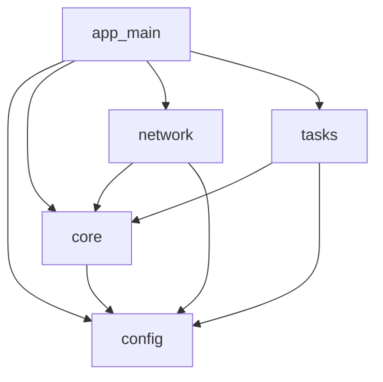
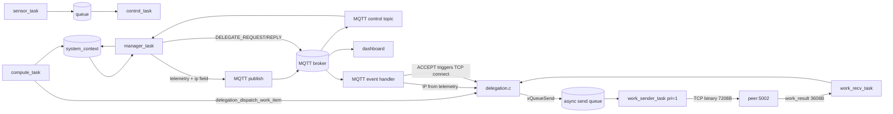
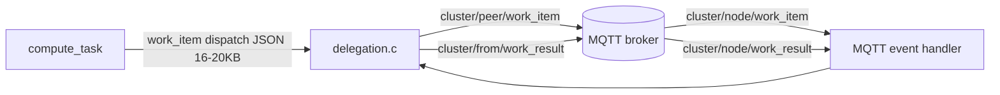

# Firmware Architecture

## Module Structure



## Module Annotations

| Module | Responsibility | Uses ESP-IDF APIs? |
|---|---|---|
| `app_main` | system bootstrap, init order, task creation, runtime wiring, IP retrieval | Yes |
| `config` | compile-time constants and tunables | No |
| `core` | shared runtime context (`system_context_t`) and metrics logic | Minimal/indirect (metrics hook) |
| `network/wifi.c` | Wi-Fi init | Yes |
| `network/mqtt.c` | MQTT connect/subscribe/publish; control plane (telemetry, handshake, peer IP parse) | Yes |
| `network/delegation.c` | Delegation state machine, channel management, work-item dispatch, result handling | No (FreeRTOS + context) |
| `network/work_transport.c` | TCP binary work transport: server, hosting task, async sender, recv task | Yes (sockets) |
| `tasks` | periodic runtime workloads (`sensor`, `control`, `compute`, `manager`) | Mostly No |

**Layering rule:** ESP-IDF specifics are isolated to `app_main` and `network/`.
Tasks and `core/` do not call ESP-IDF directly.

---

## Data Flow (fw-0.4.0-tcp — current)



### Key data flow notes

**Control plane (MQTT — unchanged from fw-0.3.0-deleg):**
- Every node publishes telemetry to `cluster/{node_id}/telemetry` every 1s
- Telemetry now includes `"ip":"x.x.x.x"` field for peer TCP connect
- `DELEGATE_REQUEST`, `DELEGATE_REPLY` travel over `cluster/{peer}/delegate_request`
  and `cluster/{from}/delegate_reply`
- Dashboard subscribes to all topics via wildcard; REST API used by experiment scripts

**Data plane (TCP direct — fw-0.4.0-tcp):**
- On DELEGATE_ACCEPT, delegating node opens TCP connection to `peer_ip:5002`
- Binary frame: `work_frame_hdr_t` (8 bytes packed: magic=0xDA7A, type, block_id,
  cycle_id) + 7200-byte payload = 7208 bytes total for work_item
- Result frame: 8-byte header + 3600-byte result = 3608 bytes
- No MQTT broker relay for work items — direct peer TCP
- `compute_task` posts to a FreeRTOS queue (non-blocking); `work_sender_task`
  (priority 1) drains the queue and calls `send_exact()` in its idle time

**TCP transport task lifecycle:**
- `work_transport_server_task` — permanent, started in `app_main` after WiFi up
- `work_hosting_task` — spawned per TCP accept, exits on disconnect
- `work_sender_task` — spawned on DELEGATE_ACCEPT, priority 1, deleted on reset
- `work_recv_task` — spawned on DELEGATE_ACCEPT, priority 3, exits on disconnect

---

## Historical Data Flow (fw-0.3.0-deleg — MQTT data plane, for reference)



**Why deprecated:** At load=800 with 9 blocks dispatched, per-dispatch overhead
exceeded 9ms (pvPortMalloc(32768) + snprintf(~16KB JSON) + MQTT publish). Nine
dispatches per 100ms cycle = >83ms overhead → exec exceeded 100ms every cycle →
miss=19.3/20 during ACTIVE delegation despite correct CPU reduction (100%→84%).
Replaced by TCP binary transport in fw-0.4.0-tcp.

---

## TCP Binary Frame Format

```c
#define WORK_TRANSPORT_MAGIC  0xDA7A
#define WORK_TRANSPORT_PORT   5002
#define WORK_FRAME_MATRIX_INTS (MATRIX_SIZE * MATRIX_SIZE)  /* 900 */

typedef enum __attribute__((packed)) {
    FRAME_WORK_ITEM   = 0x01,
    FRAME_WORK_RESULT = 0x02,
} work_frame_type_t;

typedef struct __attribute__((packed)) {
    uint16_t magic;    /* WORK_TRANSPORT_MAGIC */
    uint8_t  type;     /* work_frame_type_t    */
    uint8_t  block_id; /* block index within cycle */
    uint32_t cycle_id; /* compute cycle counter    */
} work_frame_hdr_t;   /* 8 bytes */

/* work_item payload:   int32_t matrix_a[900] + int32_t matrix_b[900] = 7200 bytes */
/* work_result payload: int32_t result[900]                            = 3600 bytes */
/* Total work_item:  8 + 7200 = 7208 bytes  (vs ~16–20 KB JSON)       */
/* Total work_result: 8 + 3600 = 3608 bytes (vs ~7 KB JSON)           */
```

**Payload comparison:**

| Metric | MQTT+JSON (fw-0.3.0-deleg) | TCP+Binary (fw-0.4.0-tcp) |
|---|---|---|
| work_item size | ~16–20 KB | 7208 bytes |
| work_result size | ~7 KB | 3608 bytes |
| Buffer alloc | pvPortMalloc(32768) | pvPortMalloc(7208) |
| Serialisation | snprintf ~16KB | memcpy 7200 bytes |
| Transport | MQTT broker relay | Direct TCP peer |
| Per-dispatch overhead (measured) | >9ms | <1ms (async enqueue) |

---

## Delegation Channel Lifecycle (fw-0.4.0-tcp)

```
app_main
  └─ for each channel: tcp_fd=-1, tcp_send_queue=NULL, tcp_sender_task=NULL

On DELEGATE_ACCEPT received (delegation.c):
  1. find peer_ip from peer table (IP learned from MQTT telemetry)
  2. work_transport_connect(ctx, peer_ip, channel_idx):
       - socket() + connect() to peer:5002
       - setsockopt(SO_SNDTIMEO) AFTER connect (lwIP quirk — DEC-021)
       - xQueueCreate(WORK_SEND_QUEUE_DEPTH=20)
       - xTaskCreate(work_sender_task, priority=1)
       - xTaskCreate(work_recv_task, priority=3)
       - stores tcp_fd, tcp_send_queue, tcp_sender_task into ctx->channels[idx]
  3. channels[idx].state = CHAN_ACTIVE

Per compute cycle (compute_task → delegation.c → work_transport.c):
  4. delegation_dispatch_work_item() called for each dispatch_block
  5. work_transport_enqueue_item(q, cycle_id, block_id, matrix_a, matrix_b):
       - pvPortMalloc(7208), copy header + matrices
       - xQueueSend(q, &item, 0)  ← non-blocking; returns DISPATCH_BUSY if full
  6. work_sender_task (priority 1, runs in compute's idle window):
       - xQueueReceive blocks until item available
       - send_exact(fd, frame_buf, 7208)  ← blocking TCP send
       - vPortFree(frame_buf)
  7. work_recv_task (priority 3) on the same fd:
       - recv_exact header + result (3608 bytes)
       - delegation_handle_work_result_tcp(ctx, cycle_id, block_id, ch_idx, result)
       - updates pending_work[], decrements in_flight_count

On channel reset (peer lost, timeout, or graceful drain):
  8. work_transport_channel_teardown(&sender_task, &send_queue, &fd):
       - vTaskDelete(sender_task)
       - drain remaining queue frames (free their buffers)
       - vQueueDelete(send_queue)
       - shutdown(fd) + close(fd)
  9. recv_task exits naturally (recv returns 0 on shutdown)
```

---

## Resource Budget

### FreeRTOS Tasks

| Task | Stack | Priority | Count | Lifecycle |
|---|---|---|---|---|
| `sensor_task` | 2048 | 5 | 1 | Permanent |
| `control_task` | 2048 | 4 | 1 | Permanent |
| `manager_task` | 6144 | 3 | 1 | Permanent |
| `compute_task` | 8192 | 2 | 1 | Permanent |
| `work_recv_task` | 4096 | 3 | 0–4 | Per ACTIVE channel |
| `work_transport_server_task` | 3072 | 3 | 1 | Permanent (TCP phase) |
| `work_sender_task` | 3072 | **1** | 0–4 | Per ACTIVE channel |
| `work_hosting_task` | 8192 | 3 | 0–4 | Per TCP connection accepted |

**Stack budget notes:**
- `manager_task` and `compute_task` budgets were increased during Phase 4 after
  serial logs identified stack overflows in `multi-peer-run8` and `multi-peer-run9`.
- `work_hosting_task` allocates 3 × 3600-byte heap buffers (mat_a, mat_b, result)
  from heap — stack budget is for control flow only.
- `work_sender_task` at priority 1 is the key architectural choice that isolates
  WiFi TX processing from compute_task's exec window.

### Heap allocations per delegation channel (fw-0.4.0-tcp)

| Allocation | Size | Lifecycle |
|---|---|---|
| Per-channel send queue items | 7208 bytes × up to 20 = 144KB | Alloc on enqueue, free after send |
| `work_hosting_task` matrix buffers | 3 × 3600 = 10.8KB | Duration of TCP connection |
| `work_recv_task` result buffer | 3600 bytes | Duration of TCP connection |

---

## Rendering
- This file uses Mermaid blocks that render in GitHub Markdown.
- Export for dissertation figures with Mermaid CLI (`mmdc`), e.g.:
  - `mmdc -i docs/firmware-architecture.md -o docs/figures/firmware-architecture.png`
