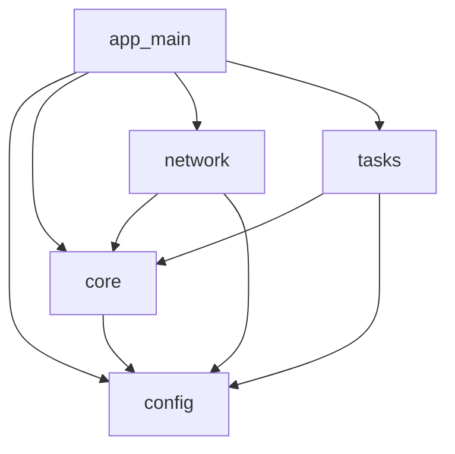
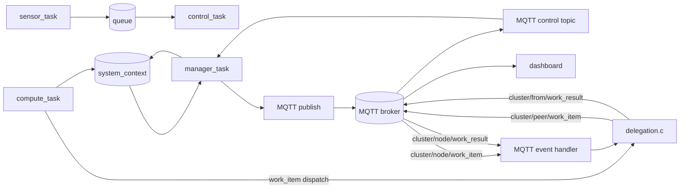

# Firmware Architecture

## Module Structure

## Module Annotations

| Module | Responsibility | Uses ESP-IDF APIs? |
|---|---|---|
| `app_main` | system bootstrap, init order, task creation, runtime wiring | Yes |
| `config` | compile-time constants and tunables | No |
| `core` | shared runtime context and metrics logic | Minimal/indirect (metrics hook) |
| `network` | Wi-Fi + MQTT connectivity and control/telemetry transport | Yes |
| `tasks` | periodic runtime workloads (`sensor`, `control`, `compute`, `manager`) | Mostly No (FreeRTOS + shared context) |

Layering rule: ESP-IDF specifics are primarily isolated to `app_main` and `network`, while scheduling/workload logic stays task/core-centric.

## Data Flow

### Notes
- `compute_task` writes execution/miss/load-related stats into `system_context`.
- `manager_task` reads aggregated context and publishes telemetry periodically.
- Control messages originate from dashboard/API via broker and are applied on-node through MQTT control handling.
- **Phase 4 delegation data plane:** when any channel is `ACTIVE`, `compute_task`
  calls `delegation_dispatch_work_item()` for the delegated portion of work. Both
  input matrices are serialised and published to the peer's `work_item` topic. The
  peer's MQTT handler invokes `delegation_handle_work_item()`, computes C = A × B,
  and publishes the result matrix back on `work_result`. The delegating node's
  handler decrements in-flight accounting and increments `deleg_blocks_returned`.
- MQTT buffer raised to 32768 bytes to accommodate full matrix payloads (~16–20 KB
  for work_item, ~8 KB for work_result).
- Multi-peer dispatch is bounded: each active channel may have at most
  `DELEGATION_MAX_INFLIGHT_PER_CHANNEL` work items in flight, pending slots are
  reclaimed by age, and `DISPATCH_BUSY` is counted/skipped rather than executed
  locally.

## Resource Budget Notes

True data-plane delegation increased task stack requirements. Serial evidence from
`multi-peer-run8` and `multi-peer-run9` showed stack overflows in `manager_task` and
`compute_task`; the configured stack budgets are now:

- `MANAGER_TASK_STACK_SIZE=6144`
- `COMPUTE_TASK_STACK_SIZE=8192`

This should be reported as an engineering consequence of moving from signalling-only
delegation to full matrix I/O exchange.

## Rendering
- This file uses Mermaid blocks that render in GitHub Markdown.
- Export for dissertation figures with Mermaid CLI (`mmdc`), e.g.:
  - `mmdc -i docs/firmware-architecture.md -o docs/figures/firmware-architecture.png`
