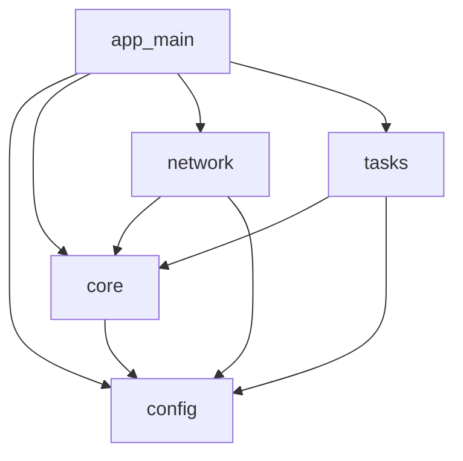
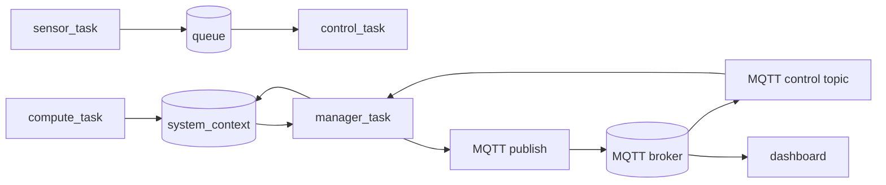

# Firmware Architecture

## Module Structure

## Module Annotations

| Module | Responsibility | Uses ESP-IDF APIs? |
|---|---|---|
| `app_main` | system bootstrap, init order, task creation, runtime wiring | Yes |
| `config` | compile-time constants and tunables | No |
| `core` | shared runtime context and metrics logic | Minimal/indirect (metrics hook) |
| `network` | Wi-Fi + MQTT connectivity and control/telemetry transport | Yes |
| `tasks` | periodic runtime workloads (`sensor`, `control`, `compute`, `manager`) | Mostly No (FreeRTOS + shared context) |

Layering rule: ESP-IDF specifics are primarily isolated to `app_main` and `network`, while scheduling/workload logic stays task/core-centric.

## Data Flow

### Notes
- `compute_task` writes execution/miss/load-related stats into `system_context`.
- `manager_task` reads aggregated context and publishes telemetry periodically.
- Control messages originate from dashboard/API via broker and are applied on-node through MQTT control handling.

## Rendering
- This file uses Mermaid blocks that render in GitHub Markdown.
- Export for dissertation figures with Mermaid CLI (`mmdc`), e.g.:
  - `mmdc -i docs/firmware-architecture.md -o docs/figures/firmware-architecture.png`
