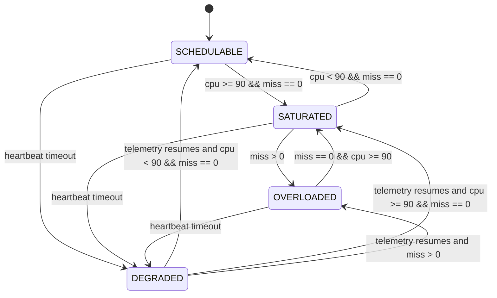
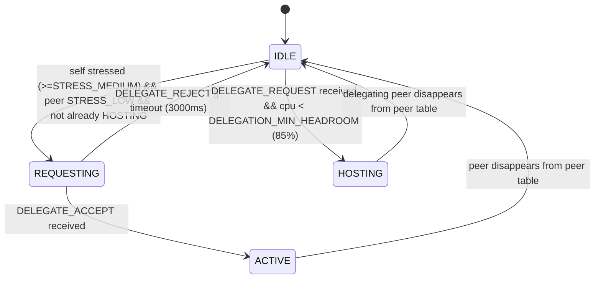
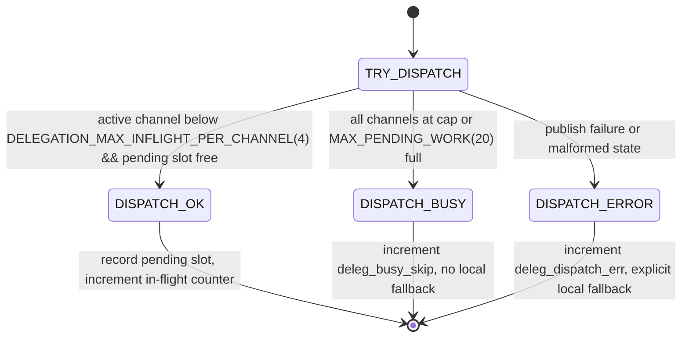

# System State Model

This model defines runtime operating states from telemetry fields.

## State Definitions
- `SCHEDULABLE`: `payload.miss == 0` and `payload.cpu < 90`
- `SATURATED`: `payload.miss == 0` and `payload.cpu >= 90`
- `OVERLOADED`: `payload.miss > 0`
- `DEGRADED`: node missing from telemetry beyond failover timeout

## Transitions
| From | To | Condition Expression | Detection Latency | Implemented? |
|---|---|---|---|---|
| SCHEDULABLE | SATURATED | `cpu >= 90 && miss == 0` | ~1 telemetry period (manager: 1000ms) + dashboard poll (~1000ms) | Yes |
| SATURATED | OVERLOADED | `miss > 0` | up to one compute window (`PROCESSING_WINDOW_CYCLES * COMPUTE_PERIOD_MS`, currently 2s) + telemetry/poll | Yes |
| OVERLOADED | SATURATED | `miss == 0 && cpu >= 90` after load reduction | window duration + telemetry/poll | Yes |
| SATURATED | SCHEDULABLE | `cpu < 90 && miss == 0` | ~1 telemetry period + poll | Yes |
| Any | DEGRADED | `now - last_seen > FAILOVER_TIMEOUT_SEC` | configured failover timeout (currently 5s) + poll | Yes |

## Notes
- Firmware publishes `state` in telemetry (`SCHEDULABLE`, `SATURATED`, `OVERLOADED`).
- `DEGRADED` is dashboard-derived from heartbeat timeout, not emitted by firmware.

---

## Delegation State Machine (Phase 4 overlay)

Each node carries up to `MAX_DELEGATION_CHANNELS` delegation channels alongside the
system state above. Telemetry reports a dominant node-level role:
`ACTIVE > REQUESTING > HOSTING > IDLE`.

**Multi-peer extension (Phase 4, fw-0.3.0-deleg):** Each node holds
`channels[MAX_DELEGATION_CHANNELS=4]`. Each channel independently cycles through
the states above. `delegation_try_offload()` opens a channel to every reachable
`STRESS_LOW` peer in a single call — not just one. Telemetry reports a dominant
node-level role: `ACTIVE > REQUESTING > HOSTING > IDLE`.

**Loop prevention:** A node that has any channel in `CHAN_HOSTING` will not call
`delegation_try_offload()`. This prevents a hosting node from re-delegating the
extra load acquired from hosting to further nodes (cascade loop). Demonstrated and
fixed after `multi-peer-run10` where node-2FCC00 at load=200 became stressed from
hosting CPU and dispatched 801 items before the guard was added.

| State | Role | Meaning |
|---|---|---|
| `IDLE` | any | No delegation in progress on this channel |
| `REQUESTING` | delegator | Sent DELEGATE_REQUEST to peer, awaiting reply |
| `ACTIVE` | delegator | Handshake accepted; dispatching work_item messages each compute cycle |
| `HOSTING` | host | Accepting work_item messages, executing C=A×B, returning work_result |

### Work item flow (ACTIVE/HOSTING pair)
- ACTIVE node: dispatches `dispatch_blocks` work items per compute cycle (100ms),
  round-robined across all ACTIVE channels. Each item carries full `matrix_a` +
  `matrix_b` inputs (~16–20KB JSON, two 30×30 int32 matrices).
- HOSTING node: executes C = A×B in MQTT callback, publishes 900-int result matrix.
- ACTIVE node: matches result to `pending_work[]` slot by `(cycle_id, block_id,
  peer_id)`, increments `deleg_blocks_returned`.
- Local compute: ACTIVE node runs `local_blocks = eff_blocks − dispatch_blocks`
  locally, freeing CPU for the fraction of work not dispatched.

### Bounded dispatch pipeline

Pending slots older than `DELEGATION_PENDING_TIMEOUT_MS=2000ms` are reclaimed,
incrementing `deleg_timeout_reclaim`.

**Key telemetry counters:**

| Counter | Meaning |
|---|---|
| `deleg_inflight_total` | Total pending slots currently in flight across all channels |
| `deleg_busy_skip` | Dispatch calls skipped because pipeline was at cap (no local fallback) |
| `deleg_timeout_reclaim` | Pending slots reclaimed by timeout (slow results) |
| `deleg_dispatch_err` | Explicit publish or state errors (with local fallback) |
| `deleg_dispatched` | Cumulative work items dispatched (node-level) |
| `deleg_returned` | Cumulative results received (node-level) |

**Empirical evidence (multi-peer-run10, session_20260426-204105):**
- 3 bystanders hosted simultaneously; victim `deleg_inflight_total` maxed at 12
  (3 channels × 4 cap) — pipeline bound confirmed
- `deleg_busy_skip=14,560`, `deleg_dispatch_err=0`, `deleg_timeout_reclaim=213`
- Victim cpu dropped from 100% to avg 59% during ACTIVE; 0 serial crashes

**Empirical evidence (deleg-load800-run2, session_20260426-214105):**
- `deleg_dispatched=2668`, `deleg_returned=2660` (99.7% return rate)
- Victim cpu 100% → 83.6% avg; miss avg 19.3/20 (misses persist — see
  `docs/threats-to-validity.md §5` for dispatch serialisation overhead analysis)
