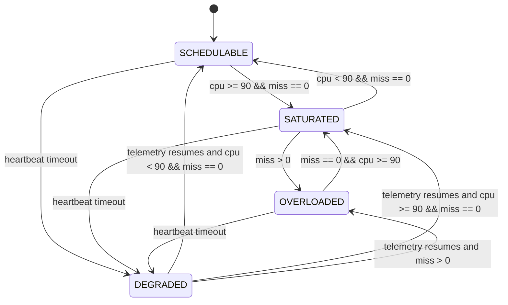
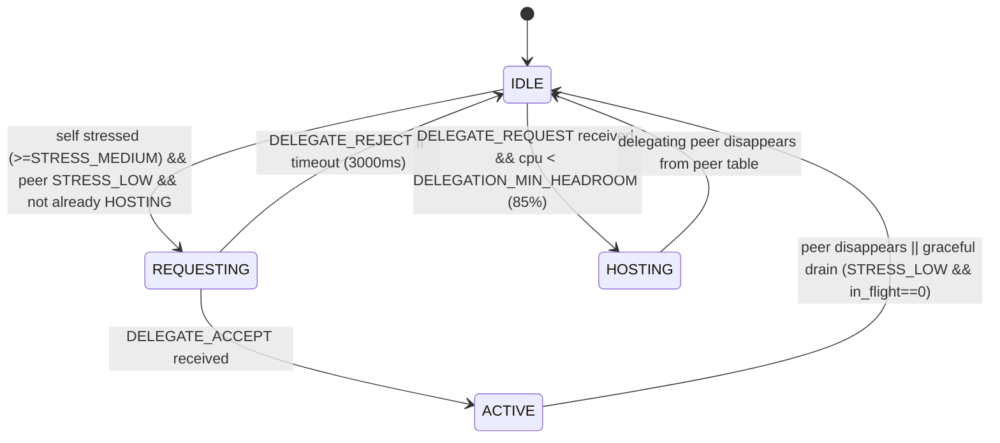
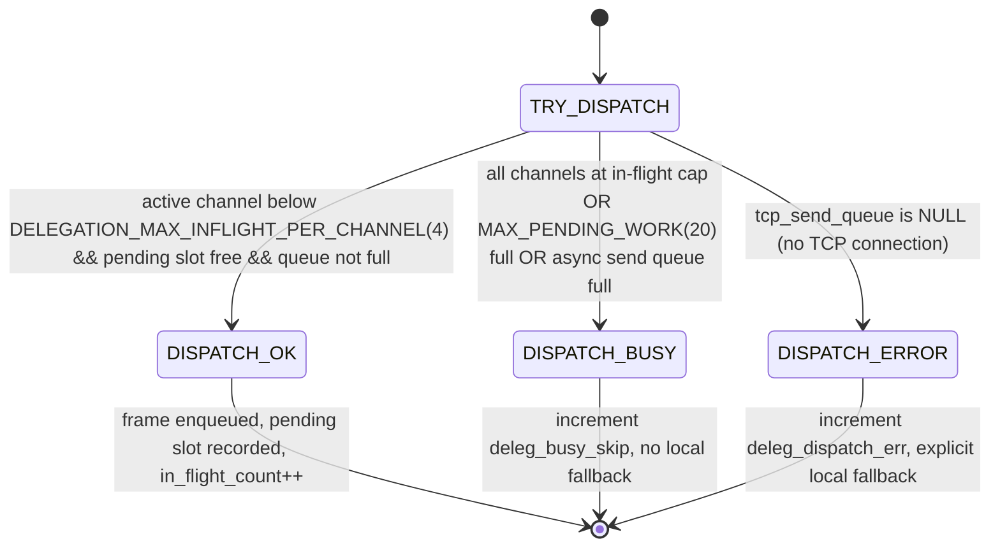

# System State Model

This model defines runtime operating states from telemetry fields.

## State Definitions
- `SCHEDULABLE`: `payload.miss == 0` and `payload.cpu < 90`
- `SATURATED`: `payload.miss == 0` and `payload.cpu >= 90`
- `OVERLOADED`: `payload.miss > 0`
- `DEGRADED`: node missing from telemetry beyond failover timeout

## Transitions
| From | To | Condition Expression | Detection Latency | Implemented? |
|---|---|---|---|---|
| SCHEDULABLE | SATURATED | `cpu >= 90 && miss == 0` | ~1 telemetry period (manager: 1000ms) + dashboard poll (~1000ms) | Yes |
| SATURATED | OVERLOADED | `miss > 0` | up to one compute window (`PROCESSING_WINDOW_CYCLES * COMPUTE_PERIOD_MS`, currently 2s) + telemetry/poll | Yes |
| OVERLOADED | SATURATED | `miss == 0 && cpu >= 90` after load reduction | window duration + telemetry/poll | Yes |
| SATURATED | SCHEDULABLE | `cpu < 90 && miss == 0` | ~1 telemetry period + poll | Yes |
| Any | DEGRADED | `now - last_seen > FAILOVER_TIMEOUT_SEC` | configured failover timeout (currently 5s) + poll | Yes |

## Notes
- Firmware publishes `state` in telemetry (`SCHEDULABLE`, `SATURATED`, `OVERLOADED`).
- `DEGRADED` is dashboard-derived from heartbeat timeout, not emitted by firmware.
- **CPU metric caveat (fw-0.4.0-tcp):** `cpu` is measured by the FreeRTOS idle hook
  and includes WiFi driver and lwIP task time, not just `compute_task` execution.
  During TCP delegation, `cpu` may show 79–85% even though `compute_task` exec_ticks
  is only ~15ms. The `miss` counter (deadline violations) is the authoritative
  schedulability indicator.

---

## Delegation State Machine (Phase 4 overlay)

Each node carries up to `MAX_DELEGATION_CHANNELS=4` delegation channels alongside
the system state above. Telemetry reports a dominant node-level role:
`ACTIVE > REQUESTING > HOSTING > IDLE`.

**Multi-peer extension (Phase 4, fw-0.3.0-deleg onward):** Each node holds
`channels[MAX_DELEGATION_CHANNELS=4]`. Each channel independently cycles through
the states above. `delegation_try_offload()` opens a channel to every reachable
`STRESS_LOW` peer in a single call. Telemetry reports a dominant node-level role:
`ACTIVE > REQUESTING > HOSTING > IDLE`.

**Loop prevention:** A node that has any channel in `CHAN_HOSTING` will not call
`delegation_try_offload()`. This prevents a hosting node from re-delegating the
extra load acquired from hosting to further nodes (cascade loop). Demonstrated and
fixed after `multi-peer-run10` where node-2FCC00 at load=200 became stressed from
hosting CPU and dispatched 801 items before the guard was added.

**Graceful drain (fw-0.4.0-tcp):** When the delegating node's load drops (STRESS_LOW)
and all in-flight items return (`in_flight_count == 0`), `delegation_tick()` closes
the channel and restores `active_blocks`. This allows TCP channels to close cleanly
after a transient overload event rather than requiring the peer to disconnect.

| State | Role | Meaning |
|---|---|---|
| `IDLE` | any | No delegation in progress on this channel |
| `REQUESTING` | delegator | Sent DELEGATE_REQUEST to peer, awaiting reply |
| `ACTIVE` | delegator | Handshake accepted; dispatching work items each compute cycle |
| `HOSTING` | host | Accepting work items via TCP, executing C=A×B, returning results |

### Work item flow (ACTIVE/HOSTING pair — fw-0.4.0-tcp TCP binary)

- ACTIVE node: `compute_task` calls `delegation_dispatch_work_item()` for each
  dispatch block. Enqueues a 7208-byte frame (header + matrix_a + matrix_b) to
  the per-channel async send queue via `work_transport_enqueue_item()`. Non-blocking.
- `work_sender_task` (priority 1): drains the queue and sends frames via TCP to
  the host's port 5002. Runs only during compute_task's ~85ms idle window.
- HOSTING node: `work_hosting_task` (spawned per TCP connection) receives frames,
  executes C = A×B locally, sends back 3608-byte result frames.
- ACTIVE node: `work_recv_task` receives result frames, calls
  `delegation_handle_work_result_tcp()`. Matches result to `pending_work[]` slot by
  `(cycle_id, block_id)`, increments `deleg_blocks_returned`, decrements `in_flight_count`.
- Local compute: ACTIVE node runs `local_blocks = eff_blocks − dispatch_blocks`
  locally, freeing CPU for the fraction of work dispatched to the host.

### Bounded dispatch pipeline

**Design note:** Queue-full is treated as `DISPATCH_BUSY` (not `DISPATCH_ERROR`),
so `compute_task` never adds a fallback `compute_kernel()` call due to send queue
lag. This is the key invariant that keeps `compute_task` exec_ticks bounded at ~15ms
regardless of TCP throughput variation.

Pending slots older than `DELEGATION_PENDING_TIMEOUT_MS=2000ms` are reclaimed,
incrementing `deleg_timeout_reclaim`.

### Key telemetry counters

| Counter | Meaning |
|---|---|
| `deleg_inflight_total` | Total pending slots currently in flight across all channels |
| `deleg_busy_skip` | Dispatch calls skipped due to in-flight cap or queue backpressure (no local fallback) |
| `deleg_timeout_reclaim` | Pending slots reclaimed by timeout (slow results) |
| `deleg_dispatch_err` | Channel not connected (tcp_send_queue NULL); with local fallback |
| `deleg_dispatched` | Cumulative work items successfully enqueued (node-level) |
| `deleg_returned` | Cumulative results received (node-level) |

---

## Empirical Evidence — Delegation Runs

### multi-peer-run10 (session_20260426-204105) — fw-0.3.0-deleg MQTT
- 3 bystanders hosted simultaneously; victim `deleg_inflight_total` maxed at 12
  (3 channels × 4 cap) — pipeline bound confirmed
- `deleg_busy_skip=14,560`, `deleg_dispatch_err=0`, `deleg_timeout_reclaim=213`
- Victim cpu dropped from 100% to avg 59% during ACTIVE; 0 serial crashes
- Loop prevention guard added in this run (hosting node was re-delegating)

### deleg-load800-run2 (session_20260426-214105) — fw-0.3.0-deleg MQTT
- `deleg_dispatched=2668`, `deleg_returned=2660` (99.7% return rate)
- Victim cpu 100% → 83.6% avg; miss avg 19.3/20
- Misses persist due to MQTT dispatch serialisation overhead on compute_task
  critical path (>9ms per dispatch, 9 dispatches per cycle). See
  `docs/threats-to-validity.md §5`.

### deleg-tcp-run6 (session_20260427-202732) — fw-0.4.0-tcp TCP binary — CANONICAL RESULT
- 4 nodes, victim=node-34A9F0, load=800/200, hold=90s
- `deleg_dispatched=5999`, `deleg_returned=5882` (98.0% return rate)
- Victim miss avg (full ACTIVE): **0.66/20**; steady-state (t≥100s): **0.12/20**
- Victim cpu steady-state: **79.2%** (down from 100% baseline)
- miss=0 in 69% of ACTIVE samples
- Multi-channel expansion: blocks ranged 3–13 during ACTIVE
- Demonstrates: OVERLOADED (miss=20/20) → near-SCHEDULABLE with delegation

### deleg-tcp-run7 (session_20260427-203819) — fw-0.4.0-tcp repeat
- 4 nodes, same config as run6
- `deleg_dispatched=13414`, `deleg_returned=13087` (97.6% return rate)
- Victim miss ss: **0.24/20**; cpu ss: **85.4%**; miss=0 in 78% of samples
- Multi-channel expanded to blocks 6–16 (3+ channels active simultaneously)
- Confirms run6 result is reproducible

### deleg-tcp-5node-run1 (session_20260427-205236) — fw-0.4.0-tcp 5-node
- 5 nodes (adds node-313978 as 5th bystander)
- `deleg_dispatched=5988`, `deleg_returned=5512` (92.1% return rate — lower due to WiFi contention)
- Victim miss ss: **1.20/20**; cpu ss: **84.5%**; miss=0 in 41% of samples
- `time_to_delegate=2018ms` (faster than 4-node ~3020ms — more candidate hosts)
- Degradation vs 4-node attributable to shared 2.4GHz channel saturation with 5 nodes

### Summary table (TCP delegation, load=800 vs no-delegation baseline)

| Run | Topology | miss avg ss | miss=0% | cpu ss | dispatched | return% |
|---|---|---|---|---|---|---|
| Baseline (Phase 1/2) | any | 20/20 | 0% | 100% | — | — |
| deleg-tcp-run6 | 4-node | **0.12/20** | 69% | 79.2% | 5999 | 98.0% |
| deleg-tcp-run7 | 4-node | **0.24/20** | 78% | 85.4% | 13414 | 97.6% |
| deleg-tcp-5node-run1 | 5-node | **1.20/20** | 41% | 84.5% | 5988 | 92.1% |

**4-node reduction:** 99% miss reduction in steady-state vs no-delegation baseline.
**5-node reduction:** 94% miss reduction; degradation is WiFi contention, not algorithm.
