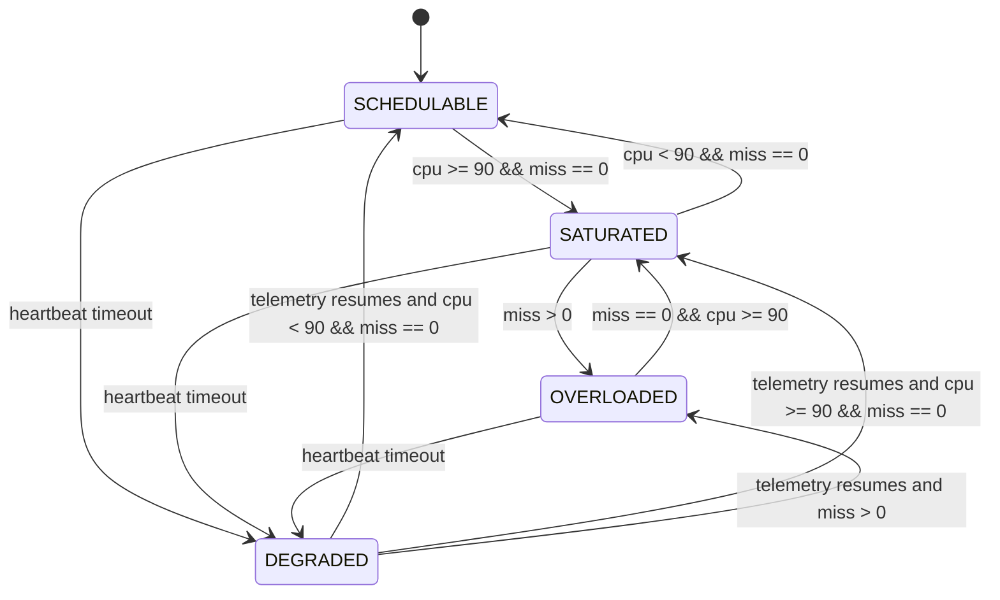

# System State Model

This model defines runtime operating states from telemetry fields.

## State Definitions
- `SCHEDULABLE`: `payload.miss == 0` and `payload.cpu < 90`
- `SATURATED`: `payload.miss == 0` and `payload.cpu >= 90`
- `OVERLOADED`: `payload.miss > 0`
- `DEGRADED`: node missing from telemetry beyond failover timeout

## Transitions
| From | To | Condition Expression | Detection Latency | Implemented? |
|---|---|---|---|---|
| SCHEDULABLE | SATURATED | `cpu >= 90 && miss == 0` | ~1 telemetry period (manager: 1000ms) + dashboard poll (~1000ms) | Yes |
| SATURATED | OVERLOADED | `miss > 0` | up to one compute window (`PROCESSING_WINDOW_CYCLES * COMPUTE_PERIOD_MS`, currently 2s) + telemetry/poll | Yes |
| OVERLOADED | SATURATED | `miss == 0 && cpu >= 90` after load reduction | window duration + telemetry/poll | Yes |
| SATURATED | SCHEDULABLE | `cpu < 90 && miss == 0` | ~1 telemetry period + poll | Yes |
| Any | DEGRADED | `now - last_seen > FAILOVER_TIMEOUT_SEC` | configured failover timeout (currently 5s) + poll | Yes |

## Notes
- Firmware publishes `state` in telemetry (`SCHEDULABLE`, `SATURATED`, `OVERLOADED`).
- `DEGRADED` is dashboard-derived from heartbeat timeout, not emitted by firmware.
